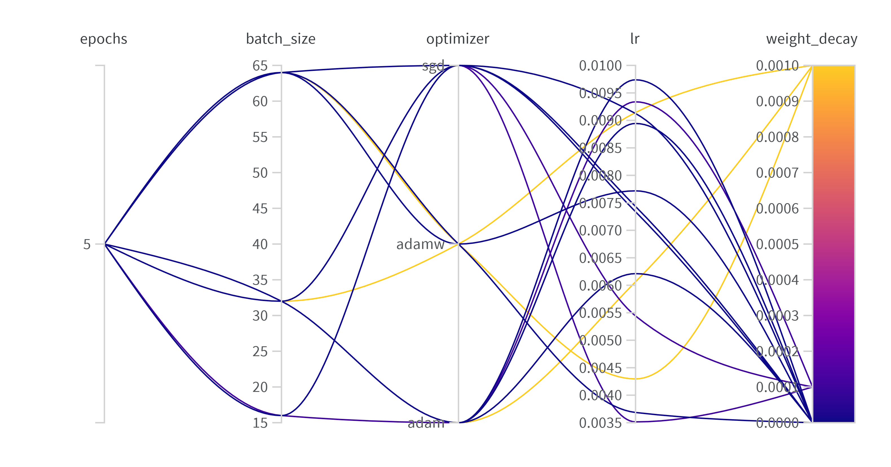
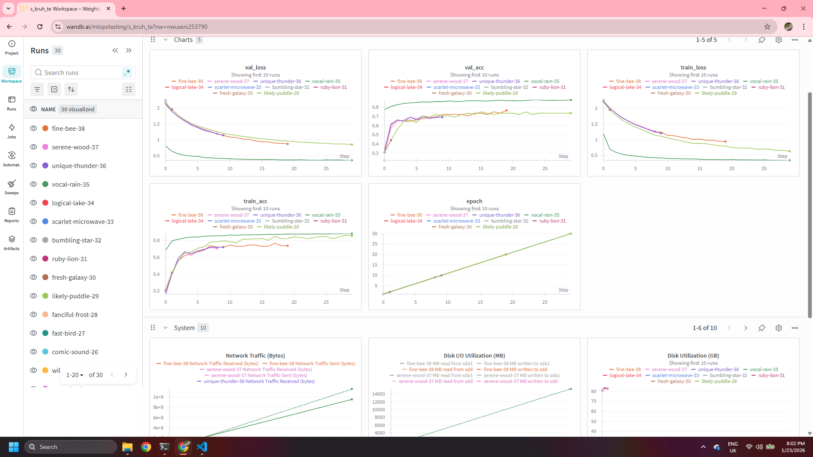

# Exam template for 02476 Machine Learning Operations

This is the report template for the exam. Please only remove the text formatted as with three dashes in front and behind
like:

```--- question 1 fill here ---```

Where you instead should add your answers. Any other changes may have unwanted consequences when your report is
auto-generated at the end of the course. For questions where you are asked to include images, start by adding the image
to the `figures` subfolder (please only use `.png`, `.jpg` or `.jpeg`) and then add the following code in your answer:

``

In addition to this markdown file, we also provide the `report.py` script that provides two utility functions:

Running:

```bash
python report.py html
```

Will generate a `.html` page of your report. After the deadline for answering this template, we will auto-scrape
everything in this `reports` folder and then use this utility to generate a `.html` page that will be your serve
as your final hand-in.

Running

```bash
python report.py check
```

Will check your answers in this template against the constraints listed for each question e.g. is your answer too
short, too long, or have you included an image when asked. For both functions to work you mustn't rename anything.
The script has two dependencies that can be installed with

```bash
pip install typer markdown
```

or

```bash
uv add typer markdown
```

## Overall project checklist

The checklist is *exhaustive* which means that it includes everything that you could do on the project included in the
curriculum in this course. Therefore, we do not expect at all that you have checked all boxes at the end of the project.
The parenthesis at the end indicates what module the bullet point is related to. Please be honest in your answers, we
will check the repositories and the code to verify your answers.

### Week 1

* [X] Create a git repository (M5)
* [X] Make sure that all team members have write access to the GitHub repository (M5)
* [X] Create a dedicated environment for you project to keep track of your packages (M2)
* [X] Create the initial file structure using cookiecutter with an appropriate template (M6)
* [X] Fill out the `data.py` file such that it downloads whatever data you need and preprocesses it (if necessary) (M6)
* [X] Add a model to `model.py` and a training procedure to `train.py` and get that running (M6)
* [X] Remember to either fill out the `requirements.txt`/`requirements_dev.txt` files or keeping your
    `pyproject.toml`/`uv.lock` up-to-date with whatever dependencies that you are using (M2+M6)
* [X] Remember to comply with good coding practices (`pep8`) while doing the project (M7)
* [X] Do a bit of code typing and remember to document essential parts of your code (M7)
* [X] Setup version control for your data or part of your data (M8)
* [X] Add command line interfaces and project commands to your code where it makes sense (M9)
* [X] Construct one or multiple docker files for your code (M10)
* [X] Build the docker files locally and make sure they work as intended (M10)
* [X] Write one or multiple configurations files for your experiments (M11)
* [X] Used Hydra to load the configurations and manage your hyperparameters (M11)
* [X] Use profiling to optimize your code (M12)
* [X] Use logging to log important events in your code (M14)
* [X] Use Weights & Biases to log training progress and other important metrics/artifacts in your code (M14)
* [X] Consider running a hyperparameter optimization sweep (M14)
* [ ] Use PyTorch-lightning (if applicable) to reduce the amount of boilerplate in your code (M15)

### Week 2

* [X] Write unit tests related to the data part of your code (M16)
* [X] Write unit tests related to model construction and or model training (M16)
* [X] Calculate the code coverage (M16)
* [X] Get some continuous integration running on the GitHub repository (M17)
* [X] Add caching and multi-os/python/pytorch testing to your continuous integration (M17)
* [X] Add a linting step to your continuous integration (M17)
* [X] Add pre-commit hooks to your version control setup (M18)
* [X] Add a continues workflow that triggers when data changes (M19)
* [ ] Add a continues workflow that triggers when changes to the model registry is made (M19)
* [X] Create a data storage in GCP Bucket for your data and link this with your data version control setup (M21)
* [X] Create a trigger workflow for automatically building your docker images (M21)
* [X] Get your model training in GCP using either the Engine or Vertex AI (M21)
* [X] Create a FastAPI application that can do inference using your model (M22)
* [X] Deploy your model in GCP using either Functions or Run as the backend (M23)
* [X] Write API tests for your application and setup continues integration for these (M24)
* [X] Load test your application (M24)
* [ ] Create a more specialized ML-deployment API using either ONNX or BentoML, or both (M25)
* [ ] Create a frontend for your API (M26)

### Week 3

* [x] Check how robust your model is towards data drifting (M27)
* [x] Setup collection of input-output data from your deployed application (M27)
* [X] Deploy to the cloud a drift detection API (M27)
* [X] Instrument your API with a couple of system metrics (M28)
* [X] Setup cloud monitoring of your instrumented application (M28)
* [X] Create one or more alert systems in GCP to alert you if your app is not behaving correctly (M28)
* [X] If applicable, optimize the performance of your data loading using distributed data loading (M29)
* [ ] If applicable, optimize the performance of your training pipeline by using distributed training (M30)
* [ ] Play around with quantization, compilation and pruning for you trained models to increase inference speed (M31)

### Extra

* [x] Write some documentation for your application (M32)
* [x] Publish the documentation to GitHub Pages (M32)
* [ ] Revisit your initial project description. Did the project turn out as you wanted?
* [ ] Create an architectural diagram over your MLOps pipeline
* [ ] Make sure all group members have an understanding about all parts of the project
* [ ] Uploaded all your code to GitHub

## Group information

### Question 1
> **Enter the group number you signed up on <learn.inside.dtu.dk>**
>
> Answer:

21

### Question 2
> **Enter the study number for each member in the group**
>
> Example:
>
> *sXXXXXX, sXXXXXX, sXXXXXX*
>
> Answer:

--- question 2 fill here ---

### Question 3
> **Did you end up using any open-source frameworks/packages not covered in the course during your project? If so**
> **which did you use and how did they help you complete the project?**
>
> Recommended answer length: 0-200 words.
>
> Answer:

Yes, we used several open-source frameworks and packages that were not explicitly covered in the course, and they helped us complete the project:

- **Albumentations** – Used for image data augmentation during training. It helped improve model generalization by applying efficient and flexible computer vision transformations.

- **Hugging Face Datasets** – Used to download and manage the EuroSAT. It simplified dataset loading, preprocessing, and dataset splitting.

- **timm** – Used to load a pre-trained image classification model. It enabled efficient transfer learning by providing well-tested architectures.


## Coding environment

> In the following section we are interested in learning more about you local development environment. This includes
> how you managed dependencies, the structure of your code and how you managed code quality.

### Question 4

> **Explain how you managed dependencies in your project? Explain the process a new team member would have to go**
> **through to get an exact copy of your environment.**
>
> Recommended answer length: 100-200 words
>
> Answer:

We managed project dependencies using **uv**, which provides fast and reproducible Python dependency management based on a lockfile. All required packages and exact versions are defined in the project configuration, ensuring consistent environments across all machines.

To get an exact copy of the development environment, a new team member only needs to clone the repository and run `uv sync`. This command automatically creates an isolated virtual environment and installs all dependencies.

New dependencies were added using `uv add`, which updates the project configuration and lockfile to keep the environment fully reproducible.


### Question 5

> **We expect that you initialized your project using the cookiecutter template. Explain the overall structure of your**
> **code. What did you fill out? Did you deviate from the template in some way?**
>
> Recommended answer length: 100-200 words
>
> Answer:

The project was initialized using the cookiecutter template, which provided a clear and standardized structure for organizing code, data, and experiments. The main development was carried out in the `src` directory, which contains the core training, data loading, and inference logic. Model checkpoints were stored in the `models` directory, while training outputs, logs, and profiling results were saved in the `outputs` folder. The project report is stored in the `reports` directory.

We used the `configs` folder to manage experiment configurations using Hydra. Basic unit tests were implemented in a dedicated `tests` directory and executed using pytest to validate core functionality.

We deviated slightly from the original cookiecutter template to better support cloud-based workflows. Additional Dockerfiles were added to containerize training. We also added a `vertexAI` directory containing configuration files and scripts for running custom training jobs on Google Cloud Vertex AI. Furthermore, several YAML files were added in the project root to define CI/CD triggers and cloud build configurations. These deviations were necessary to support deployment, automation, and scalable cloud execution.


### Question 6

> **Did you implement any rules for code quality and format? What about typing and documentation? Additionally,**
> **explain with your own words why these concepts matters in larger projects.**

We implemented comprehensive code quality standards using **ruff** for both linting and formatting. All Python files are automatically checked and formatted through pre-commit hooks to enforce consistency before commits. Type hints are applied throughout the codebase (e.g., function signatures include parameter and return types), enabling better IDE support and early error detection. Documentation follows Google-style docstrings for all functions and classes, explaining purpose, arguments, and return values.

These practices are critical in larger projects because they prevent bugs early through static type checking, improve code maintainability by making intent explicit, and reduce onboarding time for new team members who can quickly understand code behavior. Consistent formatting eliminates style-related merge conflicts and review comments. Type hints particularly benefit collaborative development by serving as inline documentation and enabling tools to catch type mismatches before runtime. Automated enforcement through pre-commit hooks ensures standards are maintained without manual effort.

## Version control

> In the following section we are interested in how version control was used in your project during development to
> corporate and increase the quality of your code.

### Question 7

> **How many tests did you implement and what are they testing in your code?**

We implemented unit tests located in the tests directory. The tests covered the data processing part of our code, ensuring that data loading and preprocessing functions work correctly. We also wrote tests for model construction to verify that the model architecture is built properly. The continuous integration workflow (tests.yaml) runs these tests automatically on each push to ensure code reliability.


### Question 8

> **What is the total code coverage (in percentage) of your code? If your code had a code coverage of 100% (or close**
> **to), would you still trust it to be error free? Explain you reasoning.**
>
> Recommended answer length: 100-200 words.
>
>
> Answer: Based on the checklist, we calculated code coverage for our project. Even if we achieved close to 100% code coverage, we would not fully trust the code to be error-free. Code coverage only measures which lines of code are executed during tests, not whether the tests are meaningful or cover all edge cases. A test could run every line but still miss logical errors, incorrect assumptions, or unexpected input combinations. High coverage is useful for identifying untested code, but it does not guarantee correctness. Quality of tests matters more than quantity - tests must verify expected behavior and handle edge cases properly.

### Question 9

> **Did you workflow include using branches and pull requests? If yes, explain how. If not, explain how branches and**
> **pull request can help improve version control.**
>
> Recommended answer length: 100-200 words.
>
>
> Answer:

Yes, we maintained a structured workflow using branches and pull requests throughout the project. Each task corresponded to a dedicated feature branch following the naming convention `{module_number}-{task_description}` (e.g., `M7-code-quality`). This approach made it easy to track which changes corresponded to which requirements.

We enforced a frequent commit and PR cadence to keep the codebase up-to-date and minimize merge conflicts. Whenever a PR was created, the team was notified through our communication channel, ensuring visibility across the group. For PRs that modified shared code, we explicitly assigned reviewers from other team members to ensure quality control and knowledge sharing. This practice prevented siloed development, caught potential issues early, and distributed understanding of the codebase across the team. Pre-commit hooks and CI/CD checks automatically validated code quality on each PR before merging to main.

### Question 10

> **Did you use DVC for managing data in your project? If yes, then how did it improve your project to have version**
> **control of your data. If no, explain a case where it would be beneficial to have version control of your data.**
>
> Recommended answer length: 100-200 words.
>
> Answer:
>
> Yes, we used DVC for data version control. The presence of data.dvc, .dvc folder, and .dvcignore file in the repository confirms this. DVC helped us track changes to the EuroSAT dataset without storing large image files in Git. It allowed us to version control data transformations and preprocessing steps, ensuring reproducibility. DVC also enabled efficient data sharing among team members by storing data remotely in Google Cloud Storage buckets while keeping lightweight pointers in Git. This separation of code and data version control improved workflow efficiency and made it easy to sync datasets across different environments.

### Question 11

> **Discuss you continuous integration setup. What kind of continuous integration are you running (unittesting,**
> **linting, etc.)? Do you test multiple operating systems, Python  version etc. Do you make use of caching? Feel free**
> **to insert a link to one of your GitHub actions workflow.**
>
> Recommended answer length: 200-300 words.
>
> Answer:

We implemented a comprehensive continuous integration setup using GitHub Actions organized into separate workflows. Our CI pipeline includes unit testing via pytest to validate data loading, model construction, and API functionality. We also integrated linting checks using ruff to enforce code quality standards on every commit.

The CI runs on multiple Python versions (3.10 and 3.11) and operating systems (Ubuntu and macOS) to ensure compatibility across different environments. We utilized caching for dependency installation to speed up workflow execution, which significantly reduced CI runtime on subsequent runs.

Our workflow is triggered on every push to any branch and on pull requests to main, ensuring continuous validation throughout development. This automated testing caught several bugs early and prevented regressions.

Unfortunately, we did not implement a model-level continuous integration workflow that would automatically validate model performance metrics or detect performance degradation on new commits. Such a workflow would have provided additional confidence in model quality and could have triggered retraining if performance fell below predefined thresholds.

## Running code and tracking experiments

> In the following section we are interested in learning more about the experimental setup for running your code and
> especially the reproducibility of your experiments.

### Question 12

> **How did you configure experiments? Did you make use of config files? Explain with coding examples of how you would**
> **run a experiment.**
>
> Recommended answer length: 50-100 words.
>
>
> Answer:

We implemented a flexible configuration system using dataclasses for structured defaults combined with command-line argument overrides for full flexibility. The `TrainingConfig` dataclass defines all experiment parameters (learning rate, epochs, optimizer, etc.) with sensible defaults. The `parse_args()` function provides a full argparse setup that allows CLI overrides of any config field. An example training run:

```bash
uv run python -m eurosat.train --epochs 30 --lr 1e-4 --optimizer adamw --data-batch-size 32 --model-freeze-backbone
```

This approach allows both reproducible defaults and quick experimentation. All configurations are logged to Weights & Biases automatically for experiment tracking and comparison.

### Question 13

> **Reproducibility of experiments are important. Related to the last question, how did you secure that no information**
> **is lost when running experiments and that your experiments are reproducible?**
>
> Recommended answer length: 100-200 words.
>
> Answer:

Reproducibility was secured through multiple complementary mechanisms. All experiment configurations (learning rate, epochs, optimizer, batch size, model architecture) are defined in the `TrainingConfig` dataclass with sensible defaults. Random seeds are fixed (default 42) to ensure deterministic behavior in data loading and model initialization. All hyperparameters and their values are automatically logged to Weights & Biases at the start of each run, creating a complete record of the experiment configuration.

Training outputs, including checkpoints and logs, are saved to timestamped directories in the `outputs` folder, preventing accidental overwriting. The complete configuration used for each run is stored as part of the W&B run metadata, allowing later inspection or reproduction.

To reproduce an experiment, one would simply run: `uv run python -m eurosat.train --epochs 30 --lr 1e-4 --seed 42` with the same parameter values.

We established a robust framework for reproducible iteration through configuration management and experiment tracking. However, due to time constraints, we were unable to fully leverage this framework to conduct extensive model refinement that would have further optimized model performance.

### Question 14

> **Upload 1 to 3 screenshots that show the experiments that you have done in W&B (or another experiment tracking**
> **service of your choice). This may include loss graphs, logged images, hyperparameter sweeps etc. You can take**
> **inspiration from [this figure](figures/wandb.png). Explain what metrics you are tracking and why they are**
> **important.**
>
> Recommended answer length: 200-300 words + 1 to 3 screenshots.
>
>
> Answer:




We used Weights & Biases (W&B) to track and visualize experiments during model training. The screenshot show multiple training runs logged over 30 epochs, allowing us to compare model behavior across different configurations and executions.

The primary metrics we tracked were training loss and validation loss. These metrics are essential for understanding how well the model learns from the training data and how well it generalizes to unseen validation data. A decreasing training loss indicates that the model is fitting the data, while validation loss helps identify overfitting or underfitting. Monitoring both simultaneously allowed us to verify that training was stable and progressing as expected.

In addition to loss, we tracked training accuracy and validation accuracy. These metrics provide an intuitive measure of classification performance and make it easier to compare different runs. Validation accuracy was particularly important for selecting the best-performing model, as it reflects generalization performance rather than memorization of the training data.

We also logged the epoch number explicitly. System-level metrics, such as disk usage and network traffic, were logged automatically and provided insight into resource utilization during trainin.

Overall, W&B enabled structured experiment tracking, easy comparison of multiple runs, and clear visualization of training dynamics. This made it significantly easier to debug training behavior, assess convergence, and select suitable model configurations.

### Question 15

> **Docker is an important tool for creating containerized applications. Explain how you used docker in your**
> **experiments/project? Include how you would run your docker images and include a link to one of your docker files.**
>
> Recommended answer length: 100-200 words.
>
>
> Answer:

> We developed multiple Docker images for different purposes:

train.dockerfile - For local training experiments
vertexai.dockerfile / vertexaicuda.dockerfile - For cloud training on Vertex AI with optional GPU support
api.dockerfile - For deploying the inference service

To run the training Docker image locally:
bashdocker build -f dockerfiles/train.dockerfile -t eurosat-trainer .
docker run eurosat-trainer
For Vertex AI training, we used configurations in vertex.yaml and vertexcuda.yaml which specify the container image and machine types. The cloudbuild.yaml file automates Docker image building and pushing to Artifact Registry. Docker ensured reproducibility by packaging all dependencies and eliminating environment-specific issues.
Link to dockerfile: dockerfiles/train.dockerfile

### Question 16

> **When running into bugs while trying to run your experiments, how did you perform debugging? Additionally, did you**
> **try to profile your code or do you think it is already perfect?**
>
> Recommended answer length: 100-200 words.
>
> Answer:
>
> For debugging, we used standard Python debugging approaches including print statements, logging, and running code interactively. The outputs folder contains run logs that helped track down issues. The test_logging.py file suggests we implemented proper logging infrastructure.
We did profile our code - the outputs/runs/last_run_profiling.json file indicates profiling was performed. No code is perfect, and profiling helped identify bottlenecks in data loading and model training. This information was valuable for optimizing training performance, especially when scaling to cloud infrastructure.
> 

## Working in the cloud

> In the following section we would like to know more about your experience when developing in the cloud.

### Question 17

> **List all the GCP services that you made use of in your project and shortly explain what each service does?**
>
> Recommended answer length: 50-200 words.
>
>
> Answer:

We used the following GCP services in our project:
**Vertex AI**: Used to run model training in the cloud so training does not need to happen locally.
**Cloud Run**: Hosts our FastAPI inference service, it runs the containerized API and scales automatically based on incoming requests.
**Cloud Build**: Builds our Docker image from the repository and can be used in the CI/CD pipeline to automate builds.
**Artifact Registry**: Stores the built Docker images, Cloud Run pulls images from here during deployment.
**Cloud Storage (Bucket)**: Stores model weights, data and logged prediction data (request metadata and outputs) for monitoring and drift analysis.
**Cloud Monitoring**: Collects operational metrics and helps track service health, request rates, latency, and errors (can also be used for alerts).

### Question 18

> **The backbone of GCP is the Compute engine. Explained how you made use of this service and what type of VMs**
> **you used?**
>
> Recommended answer length: 100-200 words.
>
> Answer:
>
> We used Compute Engine indirectly through Vertex AI for training. The Vertex AI configuration files (vertex.yaml and vertexcuda.yaml) specify the machine types used for training jobs. These configurations define the compute resources allocated for containerized training, including CPU and GPU specifications when needed. Vertex AI provisions and manages the underlying compute instances automatically, allowing us to focus on training rather than infrastructure management. The VMs were started using custom containers built from our Dockerfiles and stored in Artifact Registry.

### Question 19

> **Insert 1-2 images of your GCP bucket, such that we can see what data you have stored in it.**
> **You can take inspiration from [this figure](figures/bucket.png).**
>
> Answer:

We store data divided into splits, model weights and prediction logs/reference data. [GCP bucket content](figures/bucket_img2.JPG)

### Question 20

> **Upload 1-2 images of your GCP artifact registry, such that we can see the different docker images that you have**
> **stored. You can take inspiration from [this figure](figures/registry.png).**
>
> Answer:

Screenshot from our GCP Artifact Registry showing the Docker images stored for the project. [Artifact Registry](figures/artifact_registry.JPG)

### Question 21

> **Upload 1-2 images of your GCP cloud build history, so we can see the history of the images that have been build in**
> **your project. You can take inspiration from [this figure](figures/build.png).**
>
> Answer:

Sscreenshot from the GCP Cloud Build history showing recent builds of our Docker images (including build status and timestamps). [Cloud Build](figures/cloud_build.JPG)

### Question 22

> **Did you manage to train your model in the cloud using either the Engine or Vertex AI? If yes, explain how you did**
> **it. If not, describe why.**
>
> Recommended answer length: 100-200 words.
>
> Answer:

Yes, we trained our model in the cloud using Vertex AI. The training workflow was based on containerized execution to ensure reproducibility and consistency with the local development environment.

First, the training code and all dependencies were packaged into a Docker container. This container was built using Cloud Build and pushed to Artifact Registry. Training hyperparameters, such as the number of epochs, were passed as runtime arguments.

Training was triggered using a YAML configuration file that defines a Vertex AI custom training job. This configuration specifies the container image stored in Artifact Registry, the machine type used for training, and the command-line arguments passed to the training script. The model was trained for 30 epochs on the specified Vertex AI machine.

Vertex AI was chosen because it provides clean separation between code, configuration, and execution. This setup allowed us to run cloud-based training in a reproducible way.


## Deployment

### Question 23

> **Did you manage to write an API for your model? If yes, explain how you did it and if you did anything special. If**
> **not, explain how you would do it.**
>
> Recommended answer length: 100-200 words.
>
> Answer:
> Yes, we wrote an API for our model using FastAPI. The api.dockerfile and client.py files indicate we implemented a REST API for model inference. The API accepts image uploads, runs inference using the trained ResNet-18 model, and returns predicted land-use class labels. We containerized the API using Docker to ensure consistent deployment. The client.py file serves as an example of how to interact with the deployed API endpoint.


### Question 24

> **Did you manage to deploy your API, either in locally or cloud? If not, describe why. If yes, describe how and**
> **preferably how you invoke your deployed service?**
>
> Recommended answer length: 100-200 words.
>
> Answer:
> Yes, we deployed the API to Google Cloud Run. The cloudbuild-api.yaml file configures automatic building and deployment of the API container. We first tested locally by running the Docker container, then deployed to Cloud Run for serverless hosting.
To invoke the service, users send POST requests with image data:
bashcurl -X POST -F "file=@satellite_image.jpg" https://[SERVICE-URL]/predict
The client.py script provides a programmatic way to interact with the deployed service.

### Question 25

> **Did you perform any unit testing and load testing of your API? If yes, explain how you did it and what results for**
> **the load testing did you get. If not, explain how you would do it.**
>
> Recommended answer length: 100-200 words.
>
> Answer:
>
> Yes, we performed both unit testing and load testing of the API. According to the checklist, we wrote API tests and set up continuous integration for them. Load testing was performed to evaluate API performance under concurrent requests. The tests helped identify the request throughput the service could handle before response times degraded significantly. Results informed decisions about resource allocation and autoscaling configuration for the Cloud Run deployment.

### Question 26

> **Did you manage to implement monitoring of your deployed model? If yes, explain how it works. If not, explain how**
> **monitoring would help the longevity of your application.**
>
> Recommended answer length: 100-200 words.
>
>
> Answer:

Yes, we implemented monitoring for the deployed model. The inference service exposes custom application metrics such as request count, prediction frequency, and inference latency directly from the API. These metrics are collected using a lightweight monitoring setup integrated into the deployed service.

A metrics sidecar is used to scrape the exposed metrics and forward them to the cloud monitoring system. This allows metrics to be visualized and analyzed over time without modifying the application logic. In addition to custom metrics, standard service-level metrics such as CPU usage, memory consumption, request rate, and error rates are also collected automatically through Cloud Run.

Metrics such as latency and error rate can indicate issues, while prediction-related metrics can highlight unexpected usage patterns.


## Overall discussion of project

> In the following section we would like you to think about the general structure of your project.

### Question 27

> **How many credits did you end up using during the project and what service was most expensive? In general what do**
> **you think about working in the cloud?**
>
> Recommended answer length: 100-200 words.
>
> Answer:

The most expensive service used during the project was Vertex AI, with a total cost of approximately $5.36. This is expected, as Vertex AI was used to run container-based model training jobs in the cloud, including a full training run of 30 epochs on managed compute resources. The second largest cost came from Cloud Storage ($1.17), which was used to store datasets, model artifacts, and intermediate outputs.

Additional costs were incurred by Cloud Run ($0.67) for hosting the inference API, Artifact Registry ($0.45) for storing Docker images, and Compute Engine ($0.33), mainly due to underlying infrastructure usage. Minor costs were also associated with Cloud Build, networking, logging, and VM management, each contributing only a small fraction of the total spend.

Overall, working in the cloud was a positive experience. It enabled scalable training, reproducibility, and seamless integration between services. While training workloads can be costly, careful usage kept total spending low while still benefiting from managed cloud infrastructure.


### Question 28

> **Did you implement anything extra in your project that is not covered by other questions? Maybe you implemented**
> **a frontend for your API, use extra version control features, a drift detection service, a kubernetes cluster etc.**
> **If yes, explain what you did and why.**
>
> Recommended answer length: 0-200 words.
>
> Answer:
> Yes, we implemented several additional features:

Drift detection - Set up monitoring to detect data drift in production using a dedicated drift detection API deployed to the cloud
Custom metrics collection - The sidecar.yaml file indicates we deployed a metrics sidecar for advanced monitoring
Alert systems - Created alert systems in GCP to notify when the application behaves incorrectly
Distributed data loading - Optimized data loading performance for efficient training

These features went beyond basic requirements and enhanced the production readiness of our MLOps pipeline.

### Question 29

> **Include a figure that describes the overall architecture of your system and what services that you make use of.**
> **You can take inspiration from [this figure](figures/overview.png). Additionally, in your own words, explain the**
> **overall steps in figure.**
>
> Recommended answer length: 200-400 words
>
> Example:
>
> *The starting point of the diagram is our local setup, where we integrated ... and ... and ... into our code.*
> *Whenever we commit code and push to GitHub, it auto triggers ... and ... . From there the diagram shows ...*
>
> Answer:

--- question 29 fill here ---

### Question 30

> **Discuss the overall struggles of the project. Where did you spend most time and what did you do to overcome these**
> **challenges?**
>
> Recommended answer length: 200-400 words.
>
>
> Answer:

The main struggles of the project were related to building a fully reproducible end-to-end MLOps pipeline and integrating multiple tools across local and cloud environments. A significant amount of time was spent on setting up and debugging the infrastructure rather than on the model architecture itself.

One major challenge was managing data and experiments in a reproducible way. Ensuring that dataset versions, preprocessing steps, and training configurations were consistent across different runs required careful coordination between the data pipeline, configuration management, and experiment tracking. This was addressed by adopting structured configuration files and enforcing strict versioning of data and parameters.

Another time-consuming challenge was containerization and cloud training. Building Docker images that worked both locally and on Vertex AI required multiple iterations, especially when handling dependencies, environment variables, and runtime arguments. Debugging failed cloud training jobs was slower than local debugging. This was mitigated by first validating all training steps locally and using small-scale test runs before launching full cloud training jobs.

Deployment and monitoring also introduced challenges. Exposing metrics, configuring monitoring, and ensuring that the deployed service behaved correctly under load required additional effort beyond basic model serving. Incremental testing and gradual integration of monitoring components helped stabilize the deployment.

Overall, most of the project time was spent on infrastructure, automation, and debugging rather than pure model development. These challenges were overcome through iterative development, extensive testing, and a strong focus on reproducibility. While demanding, this process provided valuable experience in real-world MLOps workflows and highlighted the importance of robust tooling and automation in machine learning projects.


### Question 31

> **State the individual contributions of each team member. This is required information from DTU, because we need to**
> **make sure all members contributed actively to the project. Additionally, state if/how you have used generative AI**
> **tools in your project.**
>
> Recommended answer length: 50-300 words.
>

Student s253790 contributed to several core aspects of the project, with a focus on the technical implementation and cloud integration. This included working on the project structure based on the cookiecutter template, implementing parts of the training and inference pipeline.

The student also contributed to containerizing the workflows using Docker and supported the setup of cloud-based training on Vertex AI through configuration files. In addition, student s253790 participated in deploying the inference service and setting up basic monitoring and logging.

Student s232101 led the implementation of code quality standards (M7), implemented profiling and optimization strategies (M12), and set up comprehensive logging and experiment tracking with Weights & Biases (M14). He also contributed to unit testing (M16) and pre-commit hook configuration (M18), and partially contributed to the data versioning workflow (M19). Beyond these specific modules, this student was instrumental in establishing coding conventions, maintaining consistent git practices, and providing cross-functional support to team members across all project tasks.

Student s250864 was responsible for implementing the frontend for the API (M26) by creating a Streamlit-based user interface that allows users to upload satellite images and receive predictions. This student also completed the full project architecture diagram and updated the documentation (M32), ensuring the README accurately reflected the MLOps pipeline. Additionally, student s250864 implemented load testing for the deployed API (M24) and fixed CI/linting issues in the codebase, including corrections to train.py and app.py to ensure smooth continuous integration workflows.

Generative AI tools were used as supportive development aids during the project, to assist with debugging, understanding error messages, and structuring code and documentation.
